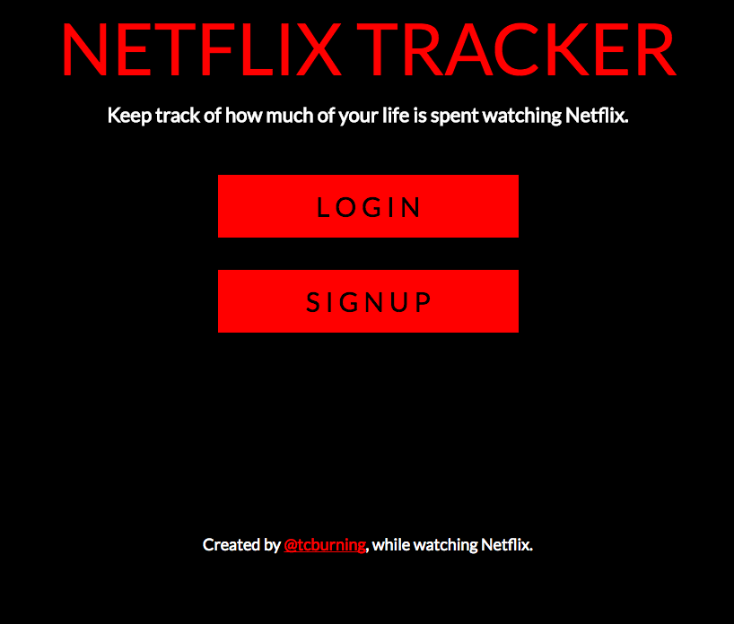
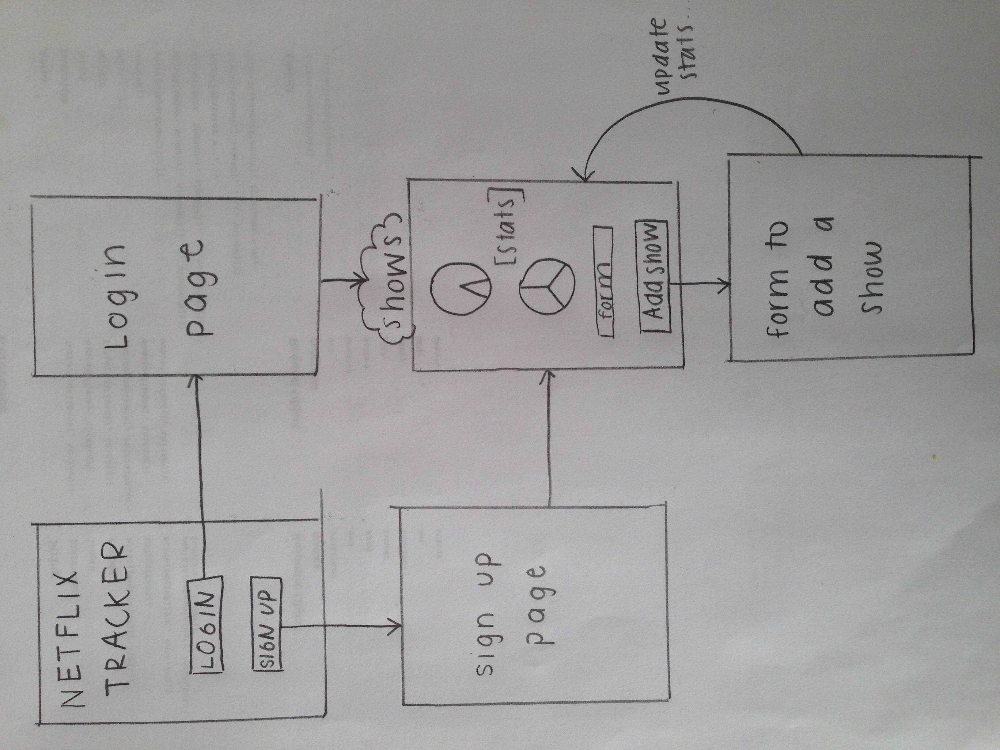

#Netflix-Tracker

Keep track of how much of your life is spent on Netflix.

Learn:

- What percentage of your time on Netflix is watching which specific shows.

- What percentage of your life you spend on Netflix in general.

- What percentage of your life you spend watching a specific show.

- Potentially more, tbd.

#How it Works

- Enter your birth date

- A user can enter shows, number of episodes, and average length of each show

- Webapp will parse the data and visualize how much time you spend Netflixing. Because this is important to know.

#Dependencies

- Express

- MongoDB

#Data Model

- Using Mongoose to store data. Minimally, will have to store Users, and Shows. See `db.js` for tentative schemas.

#Wireframes

#Site Map 

#Use Cases (Netflix user who...)

- _spend a lot of time on Netflix_: People who are intersted in knowing how much of their life is spent watching Netflix. Later iterations of the probject can look at daily/weekly/monthly/yearly intervals. The point here is ultimately to contextualize just how much time is spent watching Netflix, relative to the rest of your life.

- _want to better understand their watching patters_: People who are interested in knowing how much they spend watching certain shows in comparison to others.  Netflix recommends shows based on the type of shows you've watched in the past, but there isn't a lot of clear evaluation of how much time you spend watching one show vs another.

- _want to have fun_: It's fun!

#Research Topics

This webapp is build for NYU's [Applied Internet Technology course](http://foureyes.github.io/csci-ua.0480-spring2016-010/).

- (3 points) Integrate user authentication

- (1 point) using grunt

- (1 points) using a CSS preprocesser (LESS)

- (1 point) Concatenation and minification of CSS and JavaScript files

...for 6 points total
